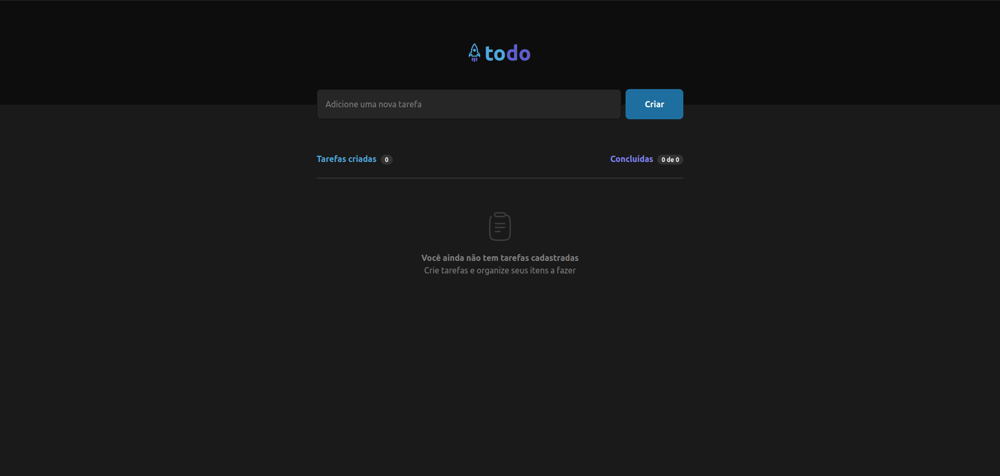

<h1 align="center">
  Vite Todo
</h1>

<h4 align="center">
  A todo website made with React + Vite + localStorage to list, complete and delete your tasks.
</h4>

<p align="center">
  <a href="#technologies">Technologies</a>&nbsp;&nbsp;&nbsp;|&nbsp;&nbsp;&nbsp;
  <a href="#how-to-use">How To Use</a>
</p>



## Technologies

This project was developed with the following technologies:

- [TypeScript](https://www.typescriptlang.org/)
- [React](https://reactjs.org/)
- [Vite](https://vitejs.dev/)
- [Tailwind CSS](https://tailwindcss.com/)
- [localStorage](https://developer.mozilla.org/en-US/docs/Web/API/Window/localStorage)

## How to use

To clone and run this application, you'll need [Git](https://git-scm.com), [Node.js v18.12.1](https://nodejs.org/en/) or higher + [pnpm v8.15.3](https://pnpm.io/) or higher installed on your computer. From your command line:

```bash
# Clone this repository
$ git clone https://github.com/vitoroberto/vite-todo.git
# Go into the repository
$ cd vite-todo
# Install dependencies
$ pnpm install
# Run the app
$ pnpm dev
```

design made by [Matheus Susko](https://www.figma.com/community/file/1175262836322989600/todo-list).
